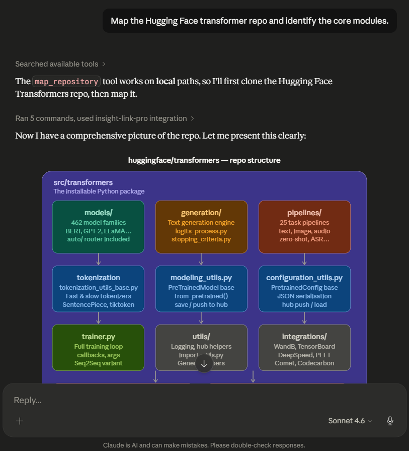
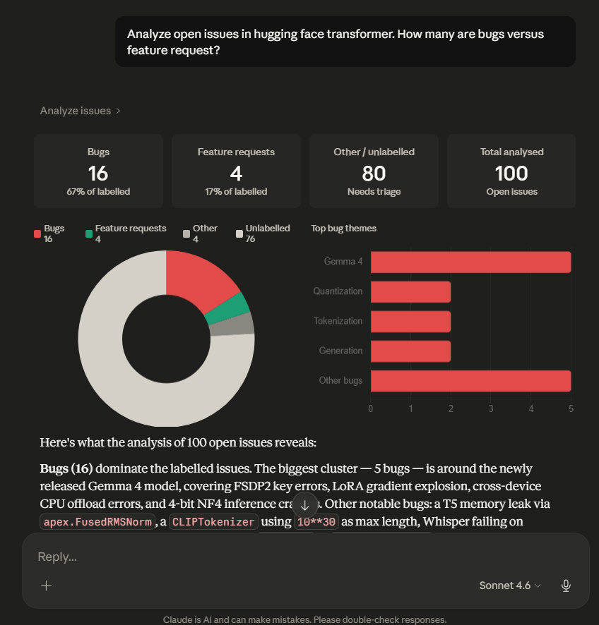

# 🔗 Insight-Link Pro

> **The Hallucination Killer** — An MCP server that grounds every LLM answer in live repository context and real-time documentation.

---

## The Problem: LLMs Hallucinate

When you ask an AI to help with your codebase, it guesses. It invents APIs that don't exist, references library versions you're not running, and misreads your architecture. The root cause: **the model has no live access to your actual code or current docs.**

Insight-Link Pro solves this with a **3-stage execution pipeline**:

| Stage | What Happens |
|-------|-------------|
| 🔭 **Exploration** | `map_repository` — understand the structure of your codebase |
| 📥 **Ingestion** | `inspect_code` + `web_to_markdown` + `search_stack_overflow` — pull real context |
| 🧠 **Synthesis** | Grounded, citation-backed answers — zero hallucination |

---

## 🎬 Demo Video

https://github.com/Lonishubh48/insight-link-pro/assets/demo.mp4

*Full walkthrough using the `huggingface/transformers` repository — covering all 6 tools in a single session.*

---

## Screenshots

### Repository Mapping



*`map_repository` walks your codebase and returns a clean, annotated file tree — giving the model an accurate picture of your project structure before it reads a single line of code.*

### Live Documentation + Diagram Generation



*Fetching the real `BackgroundTasks` implementation from the `tiangolo/fastapi` repo and Starlette source, then synthesising a grounded lifecycle diagram — no guessing, every node backed by actual source.*

---

### End-to-End Example

```
User: "Why is my FastAPI app returning 422 errors on /users endpoint?"

Insight-Link Pro:
  1. map_repository("/home/user/myapp")
     → Found: app/routes/users.py, app/models/user.py, requirements.txt

  2. inspect_code("app/routes/users.py", start_line=1, end_line=80)
     → Reads the actual route handler

  3. web_to_markdown("https://fastapi.tiangolo.com/tutorial/body/")
     → Fetches live Pydantic/FastAPI body validation docs

  4. search_stack_overflow("FastAPI 422 Unprocessable Entity pydantic validation")
     → Finds the top accepted Stack Overflow answer

Answer: "Line 34 in users.py — your UserCreate model requires `email` as a
  required field (no default), but your test client is sending `user_email`.
  See FastAPI docs §Request Body: the field name must match exactly. Stack
  Overflow answer #71234567 confirms this is the #1 cause of 422s."
```

**No guessing. Every claim is backed by a source you can verify.**

---

## Features

| Tool | Description |
|------|-------------|
| `map_repository` | Filtered file tree with .mcpignore support |
| `inspect_code` | Line-range reading with syntax highlighting |
| `web_to_markdown` | Clean Markdown from any URL via Jina AI |
| `search_stack_overflow` | Top SO answers summarised per query |
| `analyze_issues` | GitHub issues categorised by type |
| `dependency_checker` | Outdated + CVE-vulnerable packages via PyPI/npm/OSV |
| `get_session_context` | Recall everything done in the current session |
| `clear_session` | Reset session memory without restarting the server |
| `map_github_repo` | Map any public GitHub repo without cloning — use `owner/repo` format |

### Using `map_github_repo`

The `github_repo` argument must be provided in the following format:

```txt
owner/repo
```

#### ✅ Correct

```txt
milesial/pytorch-unet
```

#### ❌ Incorrect

```txt
https://github.com/milesial/pytorch-unet
```

`map_github_repo` expects only the GitHub repository identifier, not the full GitHub URL.

If an invalid format is provided, the tool will return:

```txt
ERROR: Invalid repo format. Use owner/repo (e.g. fastapi/fastapi).
```

#### Additional Examples

```txt
openai/openai-python
fastapi/fastapi
langchain-ai/langchain
microsoft/TypeScript
```
---

## Session Memory

Insight-Link Pro maintains a working memory across tool calls within a session.
This eliminates redundant re-scanning and allows context-aware follow-up answers.

| Tool | What It Records |
|------|----------------|
| `map_repository` | Active repo path and file tree |
| `inspect_code` | File path, line range, total line count |
| `web_to_markdown` | URL and content size |
| `search_stack_overflow` | Query and result count |

### Session Tools

- `get_session_context` — retrieve full session summary including repo, files read, URLs fetched, searches run, and action timeline
- `clear_session` — reset session memory without restarting the server

### Example

```
User: "Map my repository"
Claude: calls map_repository() — session records the repo

User: "Now explain the config file"
Claude: calls get_session_context() — recalls the repo path
        calls inspect_code() on config.py directly
        No re-scanning needed
```


## Setup

### 1. Clone & Install

```bash
git clone https://github.com/Lonishubh48/insight-link-pro
cd insight-link-pro
python -m venv .venv && source .venv/bin/activate
pip install -r requirements.txt
```

### 2. Configure

```bash
cp .env.example .env
# Edit .env with your API keys
```

**Required for full functionality:**

| Variable | Where to get it | Effect without it |
|----------|----------------|-------------------|
| `GITHUB_TOKEN` | [github.com/settings/tokens](https://github.com/settings/tokens) | 60 req/hr (very limited) |
| `JINA_API_KEY` | [jina.ai](https://jina.ai/) | 20 free req/day |
| `SE_API_KEY` | [stackapps.com](https://stackapps.com/apps/oauth/register) | 300 req/day |

### 3. Run

**stdio (for Claude Desktop / MCP clients):**
```bash
python main.py
```

**SSE HTTP server:**
```bash
python main.py --transport sse --port 8000
```

### 4. Connect to Claude Desktop

Add the following to your configuration file:
- **macOS/Linux:** `~/Library/Application Support/Claude/claude_desktop_config.json`
- **Windows:** `%APPDATA%\Claude\claude_desktop_config.json`
```json
{
  "mcpServers": {
    "insight-link-pro": {
      "command": "/PATH/TO/YOUR/REPO/.venv/bin/python", 
      "args": ["/PATH/TO/YOUR/REPO/main.py"],
      "env": {
        "GITHUB_TOKEN": "YOUR_TOKEN",
        "JINA_API_KEY": "YOUR_KEY",
        "SE_API_KEY": "YOUR_KEY"
      }
    }
  }
}
```

---

## Architecture

```
insight_link_pro/
├── main.py                    # FastMCP server assembly + CLI
├── core/
│   ├── config.py              # Typed settings from .env
│   └── context_manager.py     # TTL cache + shared HTTP client + budget control
│   └── session_store.py       # Session memory layer
├── tools/
│   ├── repo_tools.py          # map_repository, inspect_code
│   ├── doc_tools.py           # web_to_markdown, search_stack_overflow
│   └── analysis_tools.py      # analyze_issues, dependency_checker
│   └── session_tools.py       # get_session_context, clear_session
├── utils/
│   └── helpers.py             # Logging, rate limiter, retry decorator, formatters
├── assets/
│   ├── demo_clip.mp4
│   ├── demo_map_repository.png
│   └── demo_analysing.png
├── .env.example
└── requirements.txt
```

### Key Design Decisions

- **All tools are `async`** — no blocking I/O, scales to concurrent MCP requests.
- **TTL cache** — repeat queries hit memory, not the network (configurable TTL).
- **Token budget control** — `MAX_RESPONSE_CHARS` prevents context window explosions.
- **Rate limiters** — per-API sliding-window limiters prevent quota exhaustion.
- **Retry with backoff** — transient network errors recover automatically.
- **Clean error responses** — tools never crash; they return formatted error messages.

---

## Configuration Reference

| Variable | Default | Description |
|----------|---------|-------------|
| `GITHUB_TOKEN` | — | GitHub PAT for API access |
| `JINA_API_KEY` | — | Jina AI reader key |
| `SE_API_KEY` | — | Stack Exchange API key |
| `MAX_FILE_LINES` | `500` | Max lines per `inspect_code` call |
| `MAX_RESPONSE_CHARS` | `8000` | Hard truncation limit per tool response |
| `REQUEST_TIMEOUT` | `30` | HTTP timeout in seconds |
| `CACHE_TTL_SECONDS` | `300` | In-memory cache expiry |
| `LOG_LEVEL` | `INFO` | `DEBUG`, `INFO`, `WARNING`, `ERROR` |

---
## 🔒 Security & Privacy

Insight-Link Pro is designed with a **local-first, minimal-exposure** architecture.
Here is exactly what stays on your machine and what leaves it.

---

### What Stays 100% Local (Never Leaves Your Machine)

| Operation | Where It Runs |
|-----------|--------------|
| `map_repository` — scanning your file tree | Local filesystem only |
| `inspect_code` — reading file contents | Local filesystem only |
| All file paths, directory names, source code | Never sent anywhere |
| Your `.env` file and API keys | Local only, never logged |

> Your source code is **never uploaded, transmitted, or stored** by Insight-Link Pro.
> The server reads files locally and passes relevant snippets directly to your
> local Claude Desktop session — no third-party server ever sees your code.

---

### What Goes to External APIs (And Why)

| Tool | External API Called | Data Sent | Why |
|------|-------------------|-----------|-----|
| `web_to_markdown` | Jina AI (`r.jina.ai`) | The **URL** you provide | To fetch and convert public documentation pages |
| `search_stack_overflow` | Stack Exchange API | Your **search query string** | To find relevant Stack Overflow answers |
| `analyze_issues` | GitHub API (`api.github.com`) | The **repo name** (e.g. `fastapi/fastapi`) | To fetch public issue data |
| `dependency_checker` | PyPI, npm registry, OSV.dev | **Package names + versions** from your manifest | To check for updates and CVEs |

**Key point:** Only metadata is sent externally — never your source code.

---

### Controlling Access with `.mcpignore`

Just like `.gitignore` tells Git what to skip, `.mcpignore` tells
Insight-Link Pro what to **never scan or expose**.

Create a `.mcpignore` file in your repository root:

```bash
# .mcpignore — Insight-Link Pro will never scan these

# Sensitive configuration
.env
.env.*
*.pem
*.key
*.p12
secrets/
credentials/

# Internal business logic
internal/
proprietary/
billing/

# Large irrelevant directories
data/
datasets/
*.csv
*.parquet
```

The server checks `.mcpignore` **before** reading any file or directory.
Anything listed here is completely invisible to the MCP server.

---

### Zero-Trust Checklist for Enterprise Use

Before deploying in a professional environment, verify:

- [ ] `.mcpignore` created with sensitive paths listed
- [ ] `GITHUB_TOKEN` uses minimum required scope (`public_repo` only)
- [ ] Server runs on `stdio` transport (not exposed as a network service)
- [ ] `.env` file is in `.gitignore` (never committed to version control)
- [ ] `LOG_LEVEL=INFO` in production (not `DEBUG` — debug logs can be verbose)
- [ ] Review `MAX_RESPONSE_CHARS` to control how much content enters the LLM context

---

### Reporting a Vulnerability

Found a security issue? Please **do not open a public GitHub issue**.

Instead, email directly: `shubhamloni@gmail.com`

Include:
- Description of the vulnerability
- Steps to reproduce
- Potential impact

You will receive a response within 48 hours.

## Development

```bash
# Run tests
pytest tests/ -v

# Type-check
mypy insight_link_pro/

# Lint
ruff check .
```

---

## License

MIT © 2026 Insight-Link Pro
